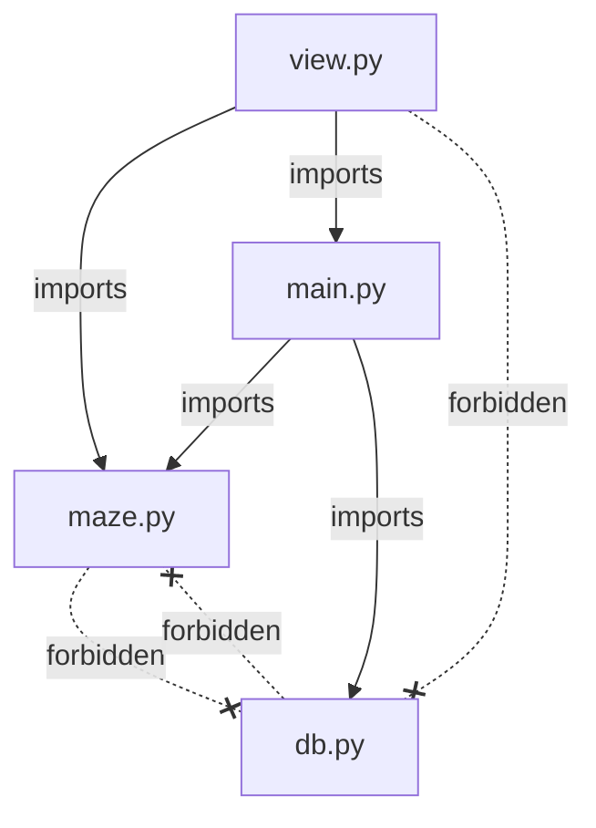

# RUNBOOK

## Dependency Rules

### Rule Table

| Module | Allowed Project Imports | Forbidden Project Imports | Allowed Stdlib / 3rd-Party | Forbidden Stdlib |
|---|---|---|---|---|
| `maze.py` | *(none)* | `db`, `main` | `dataclasses`, `enum`, `typing` | `json`, `os`, `io` |
| `db.py` | *(none)* | `maze`, `main` | `json`, `os`, `typing` | — |
| `main.py` | `maze`, `db` | — | `dataclasses`, `json`, `typing`, and anything else needed for orchestration | — |
| `view.py` *(future)* | `maze`, `main` | `db` | *(TBD)* | — |

`maze.py` and `db.py` are siblings that never import each other. `main.py` is the only module that bridges both worlds. `view.py` reaches `db.py` only through `main.py`, never directly.

### Dependency Diagram



### Enforcement

The **sibling-isolation rules** (the ones most likely to rot and the most important for parallel development) are verified by automated tests that parse source with `ast` and fail if a forbidden import appears:

| Rule | Enforcement Test | What It Checks |
|---|---|---|
| `db.py` must not import `maze` | D-G1 `test_db_does_not_import_maze` | Parses `db.py` with `ast.parse`; walks all `Import` / `ImportFrom` nodes; none reference `maze` |
| `maze.py` must not import `db` | E-F1 `test_maze_does_not_import_db` | Parses `maze.py` with `ast.parse`; walks all `Import` / `ImportFrom` nodes; none reference `db` |

---

## Definition of Done: P0 Tests

**P0 = ship-blocking.** Every test on this list must pass before the project is delivered. If any P0 test fails, the build is red and the team stops to fix it.

### How to Run Only P0 Tests

Mark every P0 test with the `@pytest.mark.p0` marker, then run:

```bash
pytest -m p0
```

To configure the marker, add to `pyproject.toml` (or `pytest.ini`):

```toml
[tool.pytest.ini_options]
markers = [
    "p0: Ship-blocking tests that must all pass before delivery",
]
```

### P0 Checklist — Infrastructure

These tests come from [interfaces-tests.md](interfaces-tests.md) and verify the serialization pipeline and architectural constraints.

| # | Test ID | Test Name | Why It's P0 |
|---|---|---|---|
| 1 | E-C1 | `test_full_pipeline_round_trip` | The single integration gate — proves `maze.py`, `main.py`, and `db.py` work together end-to-end through a real `JsonFileRepository` on disk |
| 2 | E-D1 | `test_corrupt_save_falls_back_to_new_game` | A corrupted save file must never crash the game; the engine must catch the error and start a fresh game |
| 3 | D-G1 | `test_db_does_not_import_maze` | Enforces the dependency rule that keeps persistence generic and decoupled from domain logic |
| 4 | E-F1 | `test_maze_does_not_import_db` | Enforces the dependency rule that keeps domain logic free of persistence concerns |

### P0 Checklist — Gameplay

These tests come from [game_concept.md](game_concept.md) Section B and verify that the core gameplay loop works as designed. Full test specifications are in the **Gameplay Behavior Tests** section of [interfaces-tests.md](interfaces-tests.md) (`tests/test_gameplay.py`).

| # | Concept Test | Test IDs | Description | Why It's P0 |
|---|---|---|---|---|
| 5 | #1 | *(spec pending)* | Player can select their character | Required to start the game; establishes the initial player identity/state |
| 6 | #2 | G-A1 | Maze generation produces a valid grid | No maze means no game |
| 7 | #3 | G-A2 | Generated maze is solvable via DFS | An unsolvable maze is an unwinnable game |
| 8 | #3 *(second "#3")* | G-A4 | Clogs are placed in the maze | Clogs are the core challenge mechanic; without them the game has no obstacles |
| 9 | #4, edge #1, edge #2 | G-A3, G-B1, G-B2, G-B3 | Player can move through open passages; walls block movement; clogs block passage; maze walls are consistent | Movement is the fundamental player action; clogs must block to enforce the trivia loop |
| 10 | #5, #6 | G-C1 | Player can interact with a clog and receive a question | The clog-to-question flow is the central gameplay loop |
| 11 | #7 | G-C2, G-C3 | Correct answer: clog clears, +10 energy | Reward feedback must work for the game to feel responsive |
| 12 | #8 | G-C4, G-C5, G-C6 | Incorrect answer: clog persists, -5 energy, new question | Penalty feedback must work to create challenge and consequence |
| 13 | #9 | G-D1, G-D2 | Phase beam: costs 50 energy, clears clog instantly | The phase beam is the only energy-spending ability; it must function |
| 14 | #10 | G-D3, G-D4 | Phase beam denied when energy < 50; allowed at exactly 50 | Prevents negative-cost exploits; guards the energy economy |
| 15 | #11 | G-E1, G-E2, G-E3 | Level win: all blocking clogs cleared; +25 energy (perfect) or +15 (imperfect) | The level completion condition and bonus must trigger correctly |
| 16 | #12 | G-F1, G-F2 | Game victory: all levels completed (`current_level > total_levels`) | The victory condition must trigger correctly for the game to have an ending |

> **Note:** Concept test #1 (character selection) does not yet have a corresponding test specification in `interfaces-tests.md`. It requires view/UI interaction that falls outside the current three-module scope. It should be specified when the `view.py` test spec is written.

---

## P1 Tests (Non-Blocking)

P1 tests are important for quality and confidence but do not gate delivery. They cover:

- **Dataclass defaults and field semantics** — `Position` immutability/hashability (M-A1 – M-A5), `Direction` enum members (M-B1 – M-B2), `Question` defaults (M-C1 – M-C3), `Room` flag defaults (M-D1 – M-D4), `Player` energy defaults (M-E1 – M-E3), `Maze` grid/bounds (M-F1 – M-F4), `GameState` construction and defaults (M-G1 – M-G2)
- **Protocol conformance stubs** — structural subtyping checks for `MazeGenerator`, `SolvabilityChecker`, `QuestionSource`, and negative cases (M-H1 – M-H4)
- **`db.py` unit tests** — protocol conformance (D-A1), save/load round-trips (D-B1 – D-B2), `exists()` behavior (D-C1 – D-C2), overwrite semantics (D-D1), corrupt/empty/missing file handling (D-E1, D-E2, D-F1)
- **`FakeRepository` validation** — save/load fidelity, exists behavior, non-serializable rejection (E-S1 – E-S3)
- **Serialization unit tests** — `asdict` JSON-serializability, position structure, room boolean preservation (E-A1 – E-A3)
- **Deserialization unit tests** — round-trip field fidelity for player, maze dimensions, grid contents, entrance/exit, and game metadata (E-B1 – E-B5)
- **Phase 1 pipeline** — fake-repository pipeline round-trip (E-C0), missing-key resilience (E-E1)

Full details for every P1 test are in [interfaces-tests.md](interfaces-tests.md).
