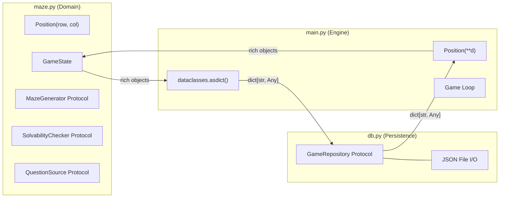

# Protocols and Dataclasses Specification

This document defines every dataclass (value object / entity) and protocol (interface contract) used across the three core modules: `maze.py`, `db.py`, and `main.py`.

---

## Module Dependency Rule

```
main.py ──imports──▶ maze.py
main.py ──imports──▶ db.py
maze.py ──✘──       db.py
db.py   ──✘──       maze.py
```

`maze.py` and `db.py` are siblings that never import each other. `main.py` is the only module with knowledge of both worlds. This keeps domain logic free of persistence concerns and keeps persistence generic.

---

## Module 1: `maze.py` — Domain Logic (Pure Python)

All domain types live here. No JSON awareness, no file I/O, no persistence imports.

### Enums

#### `Direction`

```python
class Direction(Enum):
    NORTH = auto()
    SOUTH = auto()
    EAST = auto()
    WEST = auto()
```

Cardinal directions for maze navigation. Used by game logic to interpret player movement; deliberately **not** used as dict keys inside dataclasses (see `Room` rationale below).

---

### Dataclasses

#### `Position`

```python
@dataclass(frozen=True)
class Position:
    row: int
    col: int
```

| Aspect | Detail |
|---|---|
| **Role** | Immutable value object representing a cell coordinate |
| **frozen** | `True` — instances are hashable and can be used in sets or as dict keys in domain logic |
| **Equality** | Structural (`Position(0, 1) == Position(0, 1)` is `True`) |
| **Serialization** | `dataclasses.asdict()` produces `{"row": 0, "col": 1}` — directly JSON-compatible |

#### `Question`

```python
@dataclass
class Question:
    prompt: str
    choices: list[str]
    correct_index: int
    category: str = ""
```

| Field | Type | Description |
|---|---|---|
| `prompt` | `str` | The question text shown to the player |
| `choices` | `list[str]` | Ordered answer options (typically 4) |
| `correct_index` | `int` | Zero-based index into `choices` for the correct answer |
| `category` | `str` | Optional topic tag (e.g., `"science"`, `"history"`) |

#### `Room`

```python
@dataclass
class Room:
    position: Position
    north_open: bool = False
    south_open: bool = False
    east_open: bool = False
    west_open: bool = False
    has_clog: bool = False
    is_entrance: bool = False
    is_exit: bool = False
```

| Field | Type | Default | Description |
|---|---|---|---|
| `position` | `Position` | *(required)* | Grid coordinate of this room |
| `north_open` | `bool` | `False` | Whether the north wall is open (passable) |
| `south_open` | `bool` | `False` | Whether the south wall is open |
| `east_open` | `bool` | `False` | Whether the east wall is open |
| `west_open` | `bool` | `False` | Whether the west wall is open |
| `has_clog` | `bool` | `False` | Whether a clog (blockage) occupies this room |
| `is_entrance` | `bool` | `False` | Whether this room is the maze entrance |
| `is_exit` | `bool` | `False` | Whether this room is the maze exit |

**Design rationale — explicit booleans vs. `dict[Direction, bool]`:**
A dict with `Direction` enum keys would serialize via `dataclasses.asdict()` into `{<Direction.NORTH: 1>: True, ...}` — non-string keys that `json.dump` rejects. Explicit boolean fields avoid this entirely and serialize cleanly without custom logic.

#### `Player`

```python
@dataclass
class Player:
    name: str
    position: Position
    energy: int = 0
```

| Field | Type | Default | Description |
|---|---|---|---|
| `name` | `str` | *(required)* | Player-chosen character name |
| `position` | `Position` | *(required)* | Current location in the maze |
| `energy` | `int` | `0` | Accumulated energy points; spent on the phase beam (50 per use), gained by answering correctly (+10) or lost on wrong answers (−5) |

Energy does **not** gate movement or basic interaction — it is exclusively the currency for the phase beam ability.

#### `Maze`

```python
@dataclass
class Maze:
    rows: int
    cols: int
    grid: list[list[Room]]
    entrance: Position
    exit_pos: Position
```

| Field | Type | Description |
|---|---|---|
| `rows` | `int` | Number of rows in the grid |
| `cols` | `int` | Number of columns in the grid |
| `grid` | `list[list[Room]]` | 2D grid accessed as `grid[row][col]` |
| `entrance` | `Position` | Starting cell |
| `exit_pos` | `Position` | Goal cell |

**Design rationale — `list[list[Room]]` vs. `dict[Position, Room]`:**
A dict keyed by `Position` objects produces non-string JSON keys. A 2D list serializes cleanly via `dataclasses.asdict()` (list of lists of dicts) and provides O(1) access through `grid[pos.row][pos.col]`.

**Invariant — wall consistency between adjacent rooms:**
If room `(r, c)` has `east_open=True`, then room `(r, c+1)` **must** have `west_open=True`, and vice versa. The same applies to north/south pairs: if `(r, c)` has `south_open=True`, then `(r+1, c)` must have `north_open=True`. Any `MazeGenerator` implementation must produce a grid satisfying this invariant. A convenience validator can verify it:

```python
def is_wall_consistent(maze: Maze) -> bool:
    for r in range(maze.rows):
        for c in range(maze.cols):
            room = maze.grid[r][c]
            if c + 1 < maze.cols:
                neighbor = maze.grid[r][c + 1]
                if room.east_open != neighbor.west_open:
                    return False
            if r + 1 < maze.rows:
                neighbor = maze.grid[r + 1][c]
                if room.south_open != neighbor.north_open:
                    return False
    return True
```

This prevents "one-way walls" where a player can walk east but not back west — a subtle bug that is hard to diagnose from gameplay alone.

#### `GameState`

```python
@dataclass
class GameState:
    player: Player
    maze: Maze
    current_level: int = 1
    total_levels: int = 3
    clogs_cleared: int = 0
    total_clogs: int = 0
```

| Field | Type | Default | Description |
|---|---|---|---|
| `player` | `Player` | *(required)* | Current player state |
| `maze` | `Maze` | *(required)* | Current maze state |
| `current_level` | `int` | `1` | Active level number (1-indexed) |
| `total_levels` | `int` | `3` | Total number of levels in the game; victory triggers when `current_level > total_levels` |
| `clogs_cleared` | `int` | `0` | Clogs the player has removed this level |
| `total_clogs` | `int` | `0` | Total clogs that were generated for this level |

`GameState` is the **aggregate root** — the single object that captures everything needed to save or resume a game. All persistence flows through this type. The `total_levels` field makes the victory condition (`current_level > total_levels`) checkable without a hard-coded constant buried in game logic.

---

### Protocols (Domain Contracts)

Protocols define **what** the system needs without prescribing **how** it's done. Concrete implementations are injected by `main.py`.

#### `MazeGenerator`

```python
class MazeGenerator(Protocol):
    def generate(self, rows: int, cols: int) -> Maze: ...
```

Produces a new `Maze` with randomly placed walls. The returned maze is **not** guaranteed to be solvable — callers should pair this with `SolvabilityChecker`.

#### `SolvabilityChecker`

```python
class SolvabilityChecker(Protocol):
    def is_solvable(self, maze: Maze) -> bool: ...
```

Returns `True` if a path exists from `maze.entrance` to `maze.exit_pos` using DFS (or any complete search). Used in a generate-then-verify loop: generate a maze, check solvability, regenerate if needed.

#### `QuestionSource`

```python
class QuestionSource(Protocol):
    def get_question(self) -> Question: ...
```

Returns the next question for the player. Implementations may draw from an external API, a local SQLite database, or a hardcoded list — the domain doesn't care.

---

## Module 2: `db.py` — Persistence (JSON I/O)

`db.py` is a generic dict-in / dict-out JSON store. It **never** imports from `maze.py` and has no knowledge of domain types.

### Protocol

#### `GameRepository`

```python
class GameRepository(Protocol):
    def save(self, data: dict[str, Any]) -> None: ...
    def load(self) -> dict[str, Any]: ...
    def exists(self) -> bool: ...
```

| Method | Description |
|---|---|
| `save` | Writes a JSON-compatible dict to persistent storage |
| `load` | Reads and returns the previously saved dict |
| `exists` | Returns `True` if a save file is present |

### Reference Implementation

```python
class JsonFileRepository:
    def __init__(self, path: str) -> None: ...
    def save(self, data: dict[str, Any]) -> None: ...   # json.dump
    def load(self) -> dict[str, Any]: ...                # json.load
    def exists(self) -> bool: ...                        # os.path.exists
```

Corrupt files should raise a standard exception (e.g., `json.JSONDecodeError`). The caller (`main.py`) catches the exception and falls back to a new game.

---

## Module 3: `main.py` — The Engine (Mapping & Orchestration)

`main.py` is the only module that imports from both `maze.py` and `db.py`. It handles:

1. **Conversion** between rich domain objects and flat JSON dicts
2. **Orchestration** of the game loop, input dispatch, and state transitions
3. **Dependency injection** — wiring concrete implementations to the protocols above

---

### Serialization Strategy: The `asdict` / Reconstruct Pattern

The bridge between `maze.py`'s rich objects and `db.py`'s raw dicts uses two complementary techniques with **no custom serialization code on the domain side**.

#### Saving (Domain → Dict)

```python
import dataclasses

state_dict = dataclasses.asdict(game_state)
repository.save(state_dict)
```

`dataclasses.asdict()` recursively converts the entire `GameState` tree — including nested `Position`, `Room`, `Player`, and `Maze` objects — into a plain dict of dicts, lists, and primitives. The result is directly JSON-serializable.

**Example output (abbreviated):**

```json
{
  "player": {
    "name": "Duke",
    "position": {"row": 2, "col": 3},
    "energy": 40
  },
  "maze": {
    "rows": 4,
    "cols": 4,
    "grid": [[{"position": {"row": 0, "col": 0}, "north_open": false, ...}, ...], ...],
    "entrance": {"row": 0, "col": 0},
    "exit_pos": {"row": 3, "col": 3}
  },
  "current_level": 1,
  "total_levels": 3,
  "clogs_cleared": 2,
  "total_clogs": 5
}
```

#### Loading (Dict → Domain)

`main.py` reconstructs domain objects bottom-up using `**` unpacking:

```python
def _dict_to_state(data: dict) -> GameState:
    maze_data = data["maze"]
    grid = [
        [
            Room(
                position=Position(**room["position"]),
                **{k: v for k, v in room.items() if k != "position"}
            )
            for room in row
        ]
        for row in maze_data["grid"]
    ]
    maze = Maze(
        rows=maze_data["rows"],
        cols=maze_data["cols"],
        grid=grid,
        entrance=Position(**maze_data["entrance"]),
        exit_pos=Position(**maze_data["exit_pos"]),
    )
    player_data = data["player"]
    player = Player(
        name=player_data["name"],
        position=Position(**player_data["position"]),
        energy=player_data["energy"],
    )
    return GameState(
        player=player,
        maze=maze,
        current_level=data.get("current_level", 1),
        total_levels=data.get("total_levels", 3),
        clogs_cleared=data.get("clogs_cleared", 0),
        total_clogs=data.get("total_clogs", 0),
    )
```

The pattern `Position(**d)` works because `Position`'s fields (`row`, `col`) exactly match the dict keys produced by `asdict()`.

#### Boundary Crossing Summary

```
maze.py                    main.py                        db.py
───────                    ───────                        ─────
Position(row=2, col=3)  →  dataclasses.asdict()  ──────→  {"row": 2, "col": 3}
                            (recursive, automatic)          json.dump() → file

Position(row=2, col=3)  ←  Position(**d)         ◀──────  {"row": 2, "col": 3}
                            (reconstruct)                   json.load() ← file
```

---

## Data Flow Diagram


